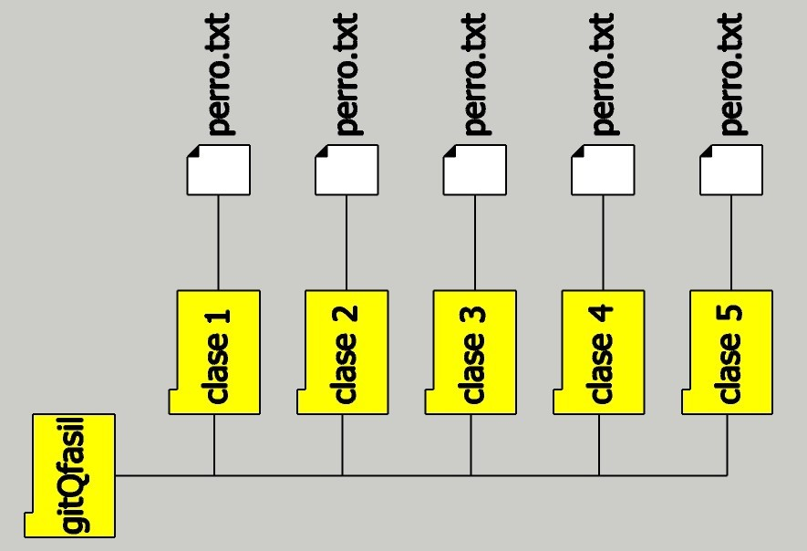

# 1. CREANDO REPOSITORIO 

crea una carpeta en cualquier lugar, pole un nombre corto yo la  llame gitQfasil
crea 5 carjpetas (clase#) y en cada   crea un archivo .txt, en c/u yo las yo   a todos los llame perro.txt

# 2. HABRIENDO EL DIRECTORIO 

podemos habrir la caperta de nuesto futuro repositorio gitQfasil-es de dos formas:

* 2.1 con 'Open Git Bash here' y te abrira una terminal CMD allí escribes la palabra 'code' y esto 

  hara que la capeta se abra en (VSCODE) y desde visual studio code (VSCODE) te diriges  a los 3 puntos y abres nueva terminal, por defecto, te
  
  abrira 'powershell' pero, tu debes elegir 'bash' 

* 2.2 la segunda forma es abrir (VSCODE) selecionar Archivo (Abrir carpeta)  y buscarla y vuando lo logres   te diriges  a los 3 puntos  y abres la nueva terminal tipo  'bash' (por asunto linux )

   ## NOTA 
   ### Diferencias entre CMD, Símbolo del Sistema,  Command Prompt, PowerShell y Bash:

   CMD, Símbolo del Sistema, Command Prompt es lo mismo  (Windwoa + x)

   CMD, PowerShell, Bash (son palabras claves o COMANDOS para controlar un sistema operativo )

   CMD para principiantes windwos
   PowerShell: avanzado, para administración de sistemas y scripting windwos 
   Bash:  Unix/Linux.

    Comados  para apertura de Terminal CMD o powershell (Windwoa + x)

   ## powershell, bash y Command Prompt desde  (VSCODE)

   **Archivo  Editar Seleccion Ver Ir   Ejecuta  ...**

### Selecione 
* ## (...)  
* ## Terminal
* ## Nuevo Terminal
* # (+   v)
    * powershell 
    * bash 
    * Command Prompt 